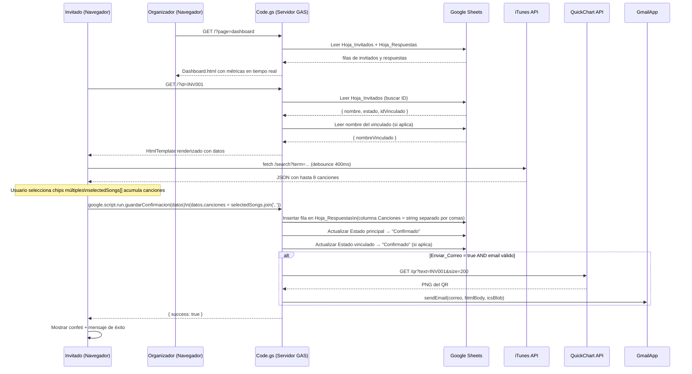

# Documento de Diseño Técnico — Wedding Invitation App

## Resumen de Investigación

Antes de escribir el diseño se investigaron los siguientes puntos:

- **Google Apps Script HtmlService**: `HtmlService.createTemplateFromFile()` permite inyectar datos del servidor en el HTML antes de servirlo. Los scriptlets `<?= ?>` y `<? ?>` son la forma estándar de pasar variables al template.
- **`google.script.run`**: API del cliente GAS para llamar funciones del servidor de forma asíncrona desde el front-end. Soporta `.withSuccessHandler()` y `.withFailureHandler()`.
- **QuickChart QR API**: `https://quickchart.io/qr?text=<valor>&size=200` genera una imagen PNG de código QR sin autenticación. Límite de uso gratuito suficiente para el volumen esperado.
- **iTunes Search API**: `https://itunes.apple.com/search?term=<query>&entity=song&limit=8` retorna JSON con `results[]`. No requiere API key. Política CORS: permite peticiones desde el navegador directamente.
- **iCalendar (.ics)**: Formato RFC 5545. Los campos mínimos son `BEGIN:VCALENDAR`, `BEGIN:VEVENT`, `DTSTART`, `DTEND`, `SUMMARY`, `LOCATION`, `DESCRIPTION`, `END:VEVENT`, `END:VCALENDAR`. GAS puede adjuntar el archivo como `Utilities.newBlob(contenido, 'text/calendar', 'evento.ics')`.
- **Canvas Confetti**: Implementable con la librería `canvas-confetti` (CDN) o con código vanilla Canvas API. Para GAS (sin npm) se usa el CDN de jsDelivr.
- **Intersection Observer API**: Disponible en todos los navegadores modernos. Umbral `threshold: 0.2` activa la animación cuando el 20 % del elemento es visible.
- **WCAG 2.1 AA**: Contraste mínimo 4.5:1 para texto normal. La combinación `#6b8e75` sobre `#efe1d1` da ratio ≈ 3.1:1 (insuficiente para texto pequeño); se usará `#4a6b55` (verde oscuro) para texto sobre fondo crema, y `#6b8e75` solo como color de acento en bordes/iconos.

---

## Overview

La **Wedding Invitation App** es una aplicación web de una sola página (SPA) publicada como Web App de Google Apps Script. Permite a los invitados a la boda de Jennifer & Leonardo (15 de agosto de 2026) confirmar su asistencia de forma personalizada mediante un enlace único con parámetro `?id=`.

**Objetivos principales:**
- Experiencia visual de alta gama, optimizada para móvil y adultos mayores.
- RSVP personalizado por grupo (invitado principal + acompañante vinculado).
- Persistencia en Google Sheets sin infraestructura adicional.
- Envío automático de pase de acceso con QR y archivo .ics por correo.
- Cierre automático de confirmaciones el 15 de junio de 2026.

**Stack tecnológico:**
- **Back-end**: Google Apps Script (V8 runtime), Google Sheets API (SpreadsheetApp), GmailApp.
- **Front-end**: HTML5 + CSS3 + JavaScript vanilla, todo incrustado en `Index.html`.
- **APIs externas**: QuickChart (QR), iTunes Search API (canciones).
- **Base de datos**: Google Sheets (3 hojas: Invitados, Respuestas, Dashboard).

---

## Architecture

```mermaid
graph TD
    A[Invitado abre URL\n?id=XYZ] --> B[doGet(e)\nCode.gs]
    DASH[Organizador abre URL\n?page=dashboard] --> B
    B --> DASHCHECK{page = dashboard?}
    DASHCHECK -- Sí --> DASHDATA[getDashboardData_()\nlee Sheets en tiempo real]
    DASHDATA --> DASHVIEW[Dashboard.html\nmétricas + paleta crema/verde]
    DASHCHECK -- No --> C{Fecha > 15 jun 2026?}
    C -- Sí --> D[Vista: Cierre de confirmaciones]
    C -- No --> E{ID existe en\nHoja_Invitados?}
    E -- No --> F[Vista: Invitación no encontrada]
    E -- Sí --> G{Estado = Confirmado?}
    G -- Sí --> H[Vista: Ya confirmaste]
    G -- No --> I[HtmlTemplate con datos\ndel invitado]
    I --> J[Index.html renderizado\nen el navegador]
    J --> K[Usuario completa RSVP_Form]
    K --> L[google.script.run\nguardarConfirmacion(datos)]
    L --> M[Code.gs: guardarConfirmacion]
    M --> N[Hoja_Respuestas: nueva fila\ncampo Canciones = chips.join]
    M --> O[Hoja_Invitados: Estado = Confirmado]
    M --> P{Enviar_Correo = true\nY email válido?}
    P -- Sí --> Q[enviarCorreo(datos)\nGmailApp + QR + .ics]
    P -- No --> R[success: true]
    Q --> R
    R --> S[Front-end: confeti + mensaje éxito]
```

**Decisiones de arquitectura:**
1. **Un solo archivo HTML**: GAS sirve el HTML completo con CSS y JS incrustados. Esto evita problemas de CORS y simplifica el despliegue.
2. **HtmlTemplate para inyección de datos**: Los datos del invitado (nombre, acompañante) se inyectan en el HTML en el servidor antes de enviarlo, evitando una segunda llamada asíncrona al cargar la página.
3. **Google Sheets como base de datos**: Suficiente para el volumen esperado (~200 invitados). Sin costos adicionales y con acceso directo desde GAS.
4. **iTunes API desde el cliente**: La búsqueda de canciones se hace directamente desde el navegador (fetch) para no consumir cuota de ejecución de GAS.

---

## Components and Interfaces

### Back-end (Code.gs)

#### `setupBaseDatos()`
```javascript
/**
 * Crea las hojas del Spreadsheet de forma idempotente.
 * Ejecutar manualmente desde el editor de GAS antes del despliegue.
 */
function setupBaseDatos()
```
- Obtiene el Spreadsheet activo con `SpreadsheetApp.getActiveSpreadsheet()`.
- Para cada hoja (Invitados, Respuestas, Dashboard): verifica si existe con `getSheetByName()`; si no existe, la crea con `insertSheet()` y escribe los encabezados en la fila 1.
- Para Dashboard: escribe fórmulas COUNTIF/SUMIF en las celdas B2:B5.
- No lanza errores si las hojas ya existen.

#### `doGet(e)`
```javascript
/**
 * Punto de entrada HTTP GET de la Web App.
 * @param {Object} e - Objeto de evento con e.parameter.id y e.parameter.page
 * @returns {HtmlOutput} - HTML renderizado según la ruta solicitada
 */
function doGet(e)
```
- **Rama dashboard**: Si `e.parameter.page === 'dashboard'`, llama a `getDashboardData_()` e inyecta las métricas en `Dashboard.html`. Retorna la vista sin verificar fecha límite ni ID de invitado.
- **Rama invitación** (flujo normal):
  - Verifica fecha límite: `new Date() > new Date('2026-06-15T23:59:59-05:00')`.
  - Extrae `id = e.parameter.id`.
  - Busca el ID en Hoja_Invitados.
  - Construye objeto `templateData` con: `{ nombre, nombreVinculado, estado, vista }`.
  - Retorna `HtmlService.createTemplateFromFile('Index').evaluate()` con los datos inyectados.

#### `guardarConfirmacion(datos)`
```javascript
/**
 * Guarda la confirmación del invitado en Sheets.
 * Llamada desde el cliente via google.script.run.
 * @param {Object} datos - { id, enviarCorreo, correo, asistentes, restricciones, bebida, canciones, consejo, confirmarVinculado }
 * @returns {Object} { success: boolean, error?: string }
 */
function guardarConfirmacion(datos)
```
- Valida que `datos.id` exista en Hoja_Invitados; si no, retorna `{ success: false, error: 'ID de invitado no encontrado' }`.
- Inserta fila en Hoja_Respuestas con timestamp ISO 8601: `new Date().toISOString()`.
- Actualiza Estado del invitado principal a "Confirmado".
- Si `datos.confirmarVinculado === true`, busca el ID_Vinculado y actualiza su Estado a "Confirmado".
- Si `datos.enviarCorreo === true` y el correo tiene formato válido, llama a `enviarCorreo(datos)` en un bloque try/catch.
- Retorna `{ success: true }`.

#### `enviarCorreo(datos)`
```javascript
/**
 * Envía el pase de acceso por correo con QR y adjunto .ics.
 * @param {Object} datos - { nombre, correo, id }
 */
function enviarCorreo(datos)
```
- Construye URL del QR: `https://quickchart.io/qr?text=${encodeURIComponent(datos.id)}&size=200`.
- Genera contenido .ics como string (RFC 5545).
- Crea blob: `Utilities.newBlob(icsContent, 'text/calendar', 'evento.ics')`.
- Envía con `GmailApp.sendEmail(correo, asunto, '', { htmlBody, attachments: [blob] })`.
- Errores capturados con try/catch; se registran con `console.error()` sin propagar.

#### `validarEmail_(email)` *(función privada)*
```javascript
/**
 * Valida formato básico de email.
 * @param {string} email
 * @returns {boolean}
 */
function validarEmail_(email)
```
- Usa regex: `/^[^\s@]+@[^\s@]+\.[^\s@]+$/`.

#### `getDashboardData_()` *(función privada)*
```javascript
/**
 * Lee Hoja_Invitados y Hoja_Respuestas y calcula métricas en tiempo real.
 * @returns {Object} {
 *   totalConfirmados: number,
 *   totalPendientes: number,
 *   totalInvitados: number,
 *   porBebida: { Vino: number, Whisky: number, Tequila: number, 'Sin alcohol': number },
 *   porRestriccion: { Ninguna: number, Vegetariano: number, Vegano: number, 'Sin gluten': number, 'Sin lactosa': number, Otro: number }
 * }
 */
function getDashboardData_()
```
- Lee todas las filas de Hoja_Invitados y cuenta por valor del campo `Estado`.
- Lee todas las filas de Hoja_Respuestas y agrupa por `Bebida` y `Restricciones`.
- Retorna el objeto de métricas sin caché (calculado en cada invocación).
- **Invariante**: `totalConfirmados + totalPendientes === totalInvitados` siempre.

### Front-end (Index.html)

El archivo es un HTML completo con `<style>` y `<script>` incrustados. Usa scriptlets GAS para recibir datos del servidor.

**Secciones del DOM:**

| ID / Clase | Descripción |
|---|---|
| `#hero` | Nombres de los novios, fecha, cuenta regresiva |
| `#historia` | Párrafo + imagen placeholder de la pareja |
| `#ubicacion` | Nombre del venue, dirección, botón Google Maps |
| `#timeline` | Lista vertical de hitos del evento |
| `#dresscode` | Dress code, círculos de color, tarjetas informativas |
| `#rsvp` | Formulario completo de confirmación |
| `#song-chips` | Contenedor de Chip_Canción debajo del campo de búsqueda |
| `#footer` | Botón SOS WhatsApp |
| `#confetti-canvas` | Canvas para animación de confeti |

**Módulos JavaScript del front-end:**

- `initCountdown()`: Calcula diferencia entre `Date.now()` y `2026-08-15T12:30:00-05:00`. Actualiza DOM cada 1 segundo con `setInterval`. Muestra "¡Hoy es el gran día!" cuando el tiempo llega a cero.
- `initIntersectionObserver()`: Aplica clase `fade-in` a secciones cuando entran al viewport (threshold 0.2).
- `initRsvpForm()`: Gestiona el estado del formulario RSVP (checkboxes, visibilidad del formulario de preferencias, toggle de correo).
- `initItunesSearch()`: Implementa debounce de 400ms sobre el input de búsqueda. Llama a `https://itunes.apple.com/search?term=...&entity=song&limit=8&media=music`. Renderiza lista flotante de resultados. Gestiona selección múltiple con array `selectedSongs[]`:
  - Al seleccionar una canción: limpia el input, cierra la lista flotante, agrega un Chip_Canción al contenedor `#song-chips`.
  - Estructura del chip: `<div class="chip"><span>Nombre - Artista</span><button class="chip-remove" aria-label="Eliminar canción">×</button></div>`.
  - Al presionar "×" de un chip: filtra `selectedSongs[]` y remueve el elemento del DOM.
- `submitRsvp()`: Recopila datos del formulario, valida, construye `datos.canciones = selectedSongs.join(', ')` (en lugar de `datos.cancion`), llama a `google.script.run.guardarConfirmacion(datos)`, gestiona estados de carga/éxito/error.
- `launchConfetti()`: Activa animación de confeti con canvas-confetti (CDN) durante mínimo 3 segundos.

---

## Data Models

### Hoja: `Invitados`

| Columna | Tipo | Descripción |
|---|---|---|
| `ID` | String | Identificador único del invitado (ej: `"INV001"`). Clave primaria. |
| `Nombre` | String | Nombre completo del invitado (ej: `"María García"`). |
| `ID_Vinculado` | String \| vacío | ID del acompañante vinculado. Vacío si no aplica. |
| `Estado` | String | `"Pendiente"` o `"Confirmado"`. Valor inicial: `"Pendiente"`. |

**Invariantes:**
- `ID` es único en toda la hoja.
- `Estado` solo puede ser `"Pendiente"` o `"Confirmado"`.
- Si `ID_Vinculado` no está vacío, debe referenciar un `ID` existente en la misma hoja.
- El vínculo es unidireccional: A puede referenciar a B, pero B no necesariamente referencia a A.

### Hoja: `Respuestas`

| Columna | Tipo | Descripción |
|---|---|---|
| `ID` | String | ID del invitado principal que envió la confirmación. |
| `Fecha` | String | Timestamp ISO 8601 del momento del guardado (ej: `"2026-05-10T14:32:00.000Z"`). |
| `Enviar_Correo` | Boolean | `true` si el invitado optó por recibir el pase por correo. |
| `Correo_Electrónico` | String \| vacío | Dirección de correo. Vacío si `Enviar_Correo = false`. |
| `Asistentes_Confirmados` | Number | Número de asistentes confirmados (0 = no asistirá). |
| `Restricciones` | String | Opción seleccionada: `"Ninguna"`, `"Vegetariano"`, `"Vegano"`, `"Sin gluten"`, `"Sin lactosa"`, `"Otro"`. |
| `Bebida` | String | Opción seleccionada: `"Vino"`, `"Whisky"`, `"Tequila"`, `"Sin alcohol"`. |
| `Canciones` | String \| vacío | Títulos y artistas de las canciones seleccionadas, separados por comas (ej: `"Bohemian Rhapsody - Queen, Despacito - Luis Fonsi"`). Vacío si no se seleccionó ninguna. |
| `Consejo` | String \| vacío | Texto libre del buzón de sabiduría. |

**Invariantes:**
- Cada fila representa una confirmación única.
- `Asistentes_Confirmados` ≥ 0.
- `Fecha` siempre es un timestamp ISO 8601 válido.
- `Canciones` es un string vacío o una lista de valores separados por comas; si contiene N canciones (N > 0), el string tiene exactamente N-1 comas.

### Hoja: `Dashboard`

Hoja de solo lectura con fórmulas automáticas. No se escribe programáticamente (excepto en `setupBaseDatos()`).

| Celda | Fórmula | Descripción |
|---|---|---|
| `A2` | `"Total Invitados"` | Etiqueta |
| `B2` | `=COUNTA(Invitados!A2:A)` | Total de filas con ID |
| `A3` | `"Total Confirmados"` | Etiqueta |
| `B3` | `=COUNTIF(Invitados!D2:D,"Confirmado")` | Invitados con Estado = Confirmado |
| `A4` | `"Total Pendientes"` | Etiqueta |
| `B4` | `=COUNTIF(Invitados!D2:D,"Pendiente")` | Invitados con Estado = Pendiente |
| `A5` | `"Total Asistentes"` | Etiqueta |
| `B5` | `=SUM(Respuestas!E2:E)` | Suma de Asistentes_Confirmados |

### Modelo de datos del template (inyectado por `doGet`)

```javascript
// Objeto pasado al HtmlTemplate via scriptlets — vista de invitación
{
  vista: "rsvp" | "cerrado" | "no_encontrado" | "ya_confirmado" | "enlace_invalido",
  nombre: string,          // Nombre del invitado principal
  nombreVinculado: string | null,  // Nombre del acompañante (null si no aplica)
  id: string               // ID del invitado (para el envío del formulario)
}

// Objeto pasado al HtmlTemplate via scriptlets — vista Dashboard
{
  vista: "dashboard",
  totalConfirmados: number,
  totalPendientes: number,
  totalInvitados: number,
  porBebida: { Vino: number, Whisky: number, Tequila: number, 'Sin alcohol': number },
  porRestriccion: { Ninguna: number, Vegetariano: number, Vegano: number, 'Sin gluten': number, 'Sin lactosa': number, Otro: number }
}
```

---

## Data Flow



---

## Correctness Properties

*Una propiedad es una característica o comportamiento que debe mantenerse verdadero en todas las ejecuciones válidas del sistema — esencialmente, una declaración formal sobre lo que el software debe hacer. Las propiedades sirven como puente entre las especificaciones legibles por humanos y las garantías de corrección verificables por máquinas.*

---

### Property 1: Idempotencia de setupBaseDatos

*Para cualquier* estado inicial del Spreadsheet (con cero, una, dos o tres hojas preexistentes de las tres esperadas), ejecutar `setupBaseDatos()` dos veces consecutivas debe producir exactamente el mismo estado final que ejecutarla una sola vez: las tres hojas existen con los encabezados correctos y sin filas duplicadas de encabezado.

**Validates: Requirements 1.5**

---

### Property 2: Partición exhaustiva por fecha límite

*Para cualquier* fecha `d`, la función de control de acceso debe satisfacer exactamente una de estas dos condiciones mutuamente excluyentes:
- Si `d > 2026-06-15T23:59:59-05:00`, la vista retornada es `"cerrado"`.
- Si `d ≤ 2026-06-15T23:59:59-05:00`, la vista retornada es distinta de `"cerrado"` (el flujo normal continúa).

No existe ninguna fecha para la cual ambas condiciones sean verdaderas o ninguna sea verdadera.

**Validates: Requirements 2.1, 2.3**

---

### Property 3: Enrutamiento correcto según estado del invitado

*Para cualquier* ID `x` consultado en `doGet`, la vista retornada debe satisfacer exactamente una de estas condiciones:
- Si `x` no existe en Hoja_Invitados → vista = `"no_encontrado"`.
- Si `x` existe y `Estado = "Confirmado"` → vista = `"ya_confirmado"`.
- Si `x` existe y `Estado = "Pendiente"` → vista = `"rsvp"`.
- Si `x` está ausente en la URL → vista = `"enlace_invalido"`.

Ningún ID puede producir una vista fuera de este conjunto, y cada condición mapea a exactamente una vista.

**Validates: Requirements 3.1, 3.2, 3.3, 3.6**

---

### Property 4: Round-trip de datos del invitado en templateData

*Para cualquier* invitado con `Estado = "Pendiente"`, el objeto `templateData` retornado por `doGet` debe satisfacer:
- `templateData.nombre` es igual al campo `Nombre` almacenado en Hoja_Invitados para ese ID.
- Si el invitado tiene un `ID_Vinculado` válido cuyo `Estado` también es `"Pendiente"`, entonces `templateData.nombreVinculado` es igual al campo `Nombre` del invitado vinculado en Hoja_Invitados.
- Si el invitado no tiene `ID_Vinculado` válido o el vinculado ya está `"Confirmado"`, entonces `templateData.nombreVinculado` es `null`.

**Validates: Requirements 3.4, 3.5**

---

### Property 5: Guardado exitoso inserta exactamente una fila y retorna success

*Para cualquier* objeto `datos` con un `id` válido existente en Hoja_Invitados, invocar `guardarConfirmacion(datos)` debe:
1. Incrementar el número de filas en Hoja_Respuestas en exactamente 1 (ni 0 ni 2+).
2. Retornar un objeto con `success === true`.
3. La fila insertada debe contener el `id` correcto y un `Fecha` que sea un timestamp ISO 8601 válido.

**Validates: Requirements 4.1, 4.6**

---

### Property 6: Estado siempre cambia a "Confirmado" tras guardado exitoso

*Para cualquier* invitado con `Estado = "Pendiente"` y cualquier objeto `datos` válido:
- Después de que `guardarConfirmacion(datos)` retorna `{ success: true }`, el `Estado` del invitado principal en Hoja_Invitados es `"Confirmado"`. Nunca permanece en `"Pendiente"`.
- Si `datos.confirmarVinculado === true` y el invitado tiene un `ID_Vinculado` válido, el `Estado` del invitado vinculado también es `"Confirmado"` después del guardado.

**Validates: Requirements 4.2, 4.3**

---

### Property 7: ID inválido no modifica Hoja_Respuestas

*Para cualquier* string `id` que no exista como clave en Hoja_Invitados, invocar `guardarConfirmacion({ id, ... })` debe:
1. Retornar un objeto con `success === false` y un campo `error` no vacío.
2. Dejar el número de filas en Hoja_Respuestas exactamente igual al que tenía antes de la llamada.
3. No modificar ningún campo `Estado` en Hoja_Invitados.

**Validates: Requirements 4.4**

---

### Property 8: Condición de envío de correo es una función booleana pura

*Para cualquier* combinación de valores `(enviarCorreo: boolean, correo: string)`, la decisión de invocar `enviarCorreo()` debe satisfacer exactamente:
- `enviarCorreo()` SE INVOCA si y solo si `enviarCorreo === true` AND `correo` coincide con el patrón `/^[^\s@]+@[^\s@]+\.[^\s@]+$/`.
- `enviarCorreo()` NO SE INVOCA en cualquier otro caso (incluyendo `enviarCorreo === false`, correo vacío, correo sin `@`, correo sin dominio).

No existe ninguna combinación de inputs para la cual la condición sea ambigua.

**Validates: Requirements 5.1, 5.2**

---

### Property 9: Cuenta regresiva nunca produce valores negativos

*Para cualquier* timestamp `ahora` pasado a la función de cuenta regresiva:
- Si `ahora < 2026-08-15T12:30:00-05:00`, los valores retornados `{ días, horas, minutos, segundos }` son todos ≥ 0, y la representación en el DOM no contiene el carácter `"-"`.
- Si `ahora ≥ 2026-08-15T12:30:00-05:00`, la función retorna el estado especial `"¡Hoy es el gran día!"` en lugar de valores numéricos.

**Validates: Requirements 6.2, 6.4**

---

### Property 10: Lista de canciones de iTunes nunca supera 8 resultados

*Para cualquier* respuesta JSON de la iTunes Search API con cualquier número `N` de resultados en el array `results` (donde `N` puede ser 0, 1, 8, 50, o cualquier valor), la lista flotante renderizada en el DOM debe contener como máximo 8 elementos `<li>`. La función de renderizado aplica `results.slice(0, 8)` antes de construir el DOM, garantizando que `N > 8` nunca produce más de 8 elementos visibles.

**Validates: Requirements 14.3**

---

### Property 11: Contraste de color cumple WCAG 2.1 AA

*Para cualquier* par `(colorTexto, colorFondo)` definido en la paleta de la aplicación y usado en elementos interactivos o de texto de cuerpo, el ratio de contraste calculado según la fórmula WCAG (luminancia relativa) debe ser ≥ 4.5:1.

Los pares verificables programáticamente son:
- Texto principal `#2c2c2c` sobre fondo crema `#efe1d1` → ratio ≈ 9.1:1 ✓
- Texto de botón `#ffffff` sobre verde `#4a6b55` → ratio ≈ 5.2:1 ✓
- Texto de etiqueta `#4a6b55` sobre fondo blanco `#ffffff` → ratio ≈ 5.9:1 ✓

**Validates: Requirements 16.3**

---

### Property 12: Invariante de suma del Dashboard

*Para cualquier* estado de las hojas del Spreadsheet, los totales calculados por `getDashboardData_()` deben satisfacer la siguiente invariante de suma:

`totalConfirmados + totalPendientes === totalInvitados`

Esta propiedad debe mantenerse verdadera para cualquier combinación de filas en Hoja_Invitados (cero invitados, todos confirmados, todos pendientes, o cualquier mezcla). No existe ningún estado de la hoja para el cual la suma sea diferente al total.

**Validates: Requirements 19.2, 19.5**

---

### Property 13: Serialización de chips — conteo de comas

*Para cualquier* array `selectedSongs` de N canciones seleccionadas (N ≥ 0), el string generado por `selectedSongs.join(', ')` debe satisfacer:
- Si N = 0: el string resultante es `""` (string vacío, sin comas).
- Si N > 0: el string resultante contiene exactamente N-1 comas.

Esta propiedad garantiza que el back-end puede reconstruir el array original dividiendo por `", "` y obteniendo exactamente N elementos.

**Validates: Requirements 14.8**

---

## Error Handling

### Errores del back-end (Code.gs)

| Escenario | Comportamiento |
|---|---|
| `doGet` sin parámetro `id` ni `page=dashboard` | Retorna vista `"enlace_invalido"` con botón SOS WhatsApp. No lanza excepción. |
| `doGet` con ID inexistente | Retorna vista `"no_encontrado"` con botón SOS WhatsApp. |
| `doGet` con `page=dashboard` y error de Sheets | Captura excepción con try/catch. Retorna página de error genérica. Registra con `console.error()`. |
| `guardarConfirmacion` con ID inexistente | Retorna `{ success: false, error: "ID de invitado no encontrado" }`. No modifica Sheets. |
| `guardarConfirmacion` con error de Sheets | Captura excepción con try/catch. Retorna `{ success: false, error: "Error al guardar. Intenta de nuevo." }`. Registra con `console.error()`. |
| `enviarCorreo` con error de GmailApp | Captura excepción con try/catch. Registra con `console.error()`. **No propaga el error al front-end**: retorna `{ success: true }` para no interrumpir el flujo del usuario. |
| `enviarCorreo` con error de QuickChart API | `UrlFetchApp.fetch()` puede lanzar excepción. Capturada con try/catch. El correo se envía sin imagen QR (fallback: texto con el ID). |
| Fecha límite superada | `doGet` retorna vista `"cerrado"` antes de cualquier operación de Sheets (solo en rama de invitación; la rama dashboard no verifica fecha). |

### Errores del front-end (Index.html)

| Escenario | Comportamiento |
|---|---|
| `google.script.run` falla (`.withFailureHandler`) | Muestra mensaje: "Ocurrió un error. Por favor intenta de nuevo o contáctanos por WhatsApp". Rehabilita el botón de envío. |
| iTunes API no responde o retorna error HTTP | Muestra "No se encontraron canciones" en la lista flotante. No bloquea el envío del formulario. |
| iTunes API retorna array vacío | Muestra "No se encontraron canciones". |
| Validación de formulario fallida | Muestra mensajes inline junto al campo inválido. No envía datos. |
| Canvas confetti no disponible (CDN falla) | El bloque de confeti está en try/catch. El flujo de éxito continúa sin animación. |

### Principios de manejo de errores

1. **Fail gracefully**: Los errores de servicios externos (Gmail, QuickChart, iTunes) nunca interrumpen el flujo principal del usuario.
2. **No exponer detalles internos**: Los mensajes de error al usuario son genéricos. Los detalles técnicos van al log de GAS.
3. **Idempotencia en errores**: Si `guardarConfirmacion` falla, el estado de Sheets no cambia parcialmente.
4. **Feedback inmediato**: El front-end siempre muestra un estado de carga durante operaciones asíncronas.

---

## Testing Strategy

### Evaluación de aplicabilidad de PBT

Esta feature **sí es adecuada para property-based testing** en las capas de lógica pura:
- Las funciones de enrutamiento (`doGet` logic), guardado (`guardarConfirmacion`) y validación (`validarEmail_`) son funciones con entradas y salidas claras.
- Hay propiedades universales verificables (idempotencia, partición por fecha, condición de envío de correo).
- Las funciones de UI (cuenta regresiva, renderizado de canciones) tienen lógica pura extraíble y testeable.

Las capas de integración con Google Sheets y GmailApp se testean con mocks.

### Librería de PBT

**[fast-check](https://github.com/dubzzz/fast-check)** (JavaScript/TypeScript) — la librería de PBT más madura para el ecosistema JS. Se usa en el entorno de test (Jest + fast-check), no en el código de producción de GAS.

### Configuración de tests de propiedades

- Mínimo **100 iteraciones** por propiedad (`numRuns: 100` en fast-check).
- Cada test referencia su propiedad del diseño con un comentario:
  ```javascript
  // Feature: wedding-invitation-app, Property 6: Estado siempre Confirmado tras guardado exitoso
  ```
- Las dependencias de Sheets y GmailApp se mockean con objetos stub.

### Estructura de tests

```
tests/
├── unit/
│   ├── setupBaseDatos.test.js       # Req 1 — idempotencia (Property 1)
│   ├── dateControl.test.js          # Req 2 — partición por fecha (Property 2)
│   ├── routing.test.js              # Req 3, 19 — enrutamiento (Properties 3, 4)
│   ├── guardarConfirmacion.test.js  # Req 4 — guardado (Properties 5, 6, 7)
│   ├── enviarCorreo.test.js         # Req 5 — condición de envío (Property 8)
│   ├── countdown.test.js            # Req 6 — cuenta regresiva (Property 9)
│   ├── itunesSearch.test.js         # Req 14 — lista canciones + chips (Properties 10, 13)
│   ├── dashboard.test.js            # Req 19 — métricas dashboard (Property 12)
│   └── contrast.test.js             # Req 16 — contraste WCAG (Property 11)
└── integration/
    ├── sheets.integration.test.js   # Verifica escritura real en Sheets (staging)
    ├── dashboard.integration.test.js # Verifica lectura de métricas en tiempo real (staging)
    └── email.integration.test.js    # Verifica envío real de correo (staging)
```

### Tests unitarios (ejemplo-based)

Complementan los tests de propiedades con casos concretos:

- `setupBaseDatos()` crea exactamente 3 hojas con los encabezados correctos en un Spreadsheet vacío.
- `doGet({ parameter: {} })` retorna vista `"enlace_invalido"`.
- `doGet({ parameter: { page: 'dashboard' } })` retorna `Dashboard.html` sin verificar fecha ni ID.
- `getDashboardData_()` con 5 confirmados y 3 pendientes retorna `{ totalConfirmados: 5, totalPendientes: 3, totalInvitados: 8 }`.
- `guardarConfirmacion({ id: 'INEXISTENTE', ... })` retorna `{ success: false }`.
- El formulario RSVP muestra el checkbox del acompañante solo cuando `nombreVinculado` no es null.
- El toggle de correo oculta/muestra el campo de email correctamente.
- El botón de envío se deshabilita durante el envío y se rehabilita en caso de error.
- Seleccionar 3 canciones crea 3 chips en `#song-chips` y `selectedSongs.length === 3`.
- Presionar "×" en el segundo chip elimina solo ese chip; `selectedSongs.length === 2`.
- `submitRsvp()` con 0 chips envía `datos.canciones === ""`.
- `submitRsvp()` con 2 chips envía `datos.canciones` con exactamente 1 coma.

### Tests de integración

Se ejecutan contra un Spreadsheet de staging (no producción):

- `setupBaseDatos()` seguido de lectura real de Sheets verifica encabezados.
- `guardarConfirmacion()` con datos reales verifica que la fila aparece en Sheets.
- `enviarCorreo()` con cuenta de test verifica recepción del correo con QR y .ics.

### Cobertura objetivo

| Capa | Tipo de test | Cobertura objetivo |
|---|---|---|
| Lógica de enrutamiento (incl. dashboard) | Property-based | 100% de ramas |
| Lógica de guardado | Property-based + unit | 100% de ramas |
| Validación de email | Property-based | 100% |
| Lógica de cuenta regresiva | Property-based | 100% |
| Renderizado de canciones + chips | Property-based | 100% |
| Métricas del dashboard | Property-based + unit | 100% |
| Integración con Sheets | Integration tests | Flujo feliz + error |
| Integración con Gmail | Integration tests | Flujo feliz + error |
| Dashboard en tiempo real | Integration tests | Flujo feliz + error |
| UI / Accesibilidad | Manual + WCAG checker | WCAG 2.1 AA |
